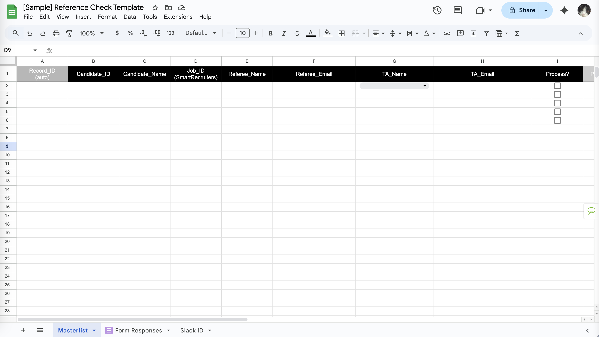

# 📄 Reference Check Automation

Automating the reference check workflow from start to finish — no more copy-pasting, manual tracking, or “just following up” emails. This project turns the tedious into seamless using Google Apps Script, Docs, Sheets, and Slack. Built for lean PeopleOps teams that want to move fast and stay compliant.

---

## ✨ Highlights

- 📌 Auto-generates prefilled Google Form links per candidate and referee  
- ✍️ Captures reference data and writes back to the masterlist on form submission  
- 🧾 Creates polished PDF reports from Google Docs templates  
- 📂 Organizes reports in structured Drive folders (by job ID & candidate name)  
- 💬 Sends Slack notifications to recruiters — fallback to email if needed  
- 🔒 Gated steps: no Slack DM unless PDF is created, no PDF unless verified  

---

## 🧩 Modules & Structure

<pre> <code>
reference-check-automation/
├── scripts/ # Modular .gs scripts (GAS)
│ ├── config.gs # Central config (IDs, tab names)
│ ├── module1_prefill.gs # Prefill logic onEdit/onOpen
│ ├── module2_emailDraft.gs# Draft email content w/ prefilled link
│ ├── module3-1_verify.gs # Write-back from Form to Masterlist
│ ├── module3-2_pdfGen.gs # PDF builder from template
│ ├── module3-3_notify.gs # Slack DM (fallback to email)
│ └── utils.gs # Helpers (date stamps, lookup, sanitizing)
├── assets/ # Screenshots, PDF samples (redacted)
│ ├── sample_form.png
│ ├── sample_sheet.png
│ ├── pdf_output.png
│ ├── slack_dm.png
│ └── flowchart.png
└── README.md
</code> </pre>

---

## 🛠️ How It Works

| Step | Trigger | Module | Output |
|------|---------|--------|--------|
| ✅ Prefill Link Generation | `onEdit` / `onOpen` | `module1_prefill.gs` | Prefilled form URL |
| ✉️ Email Draft | `onEdit` | `module2_emailDraft.gs` | Drafted message in sheet |
| 🗂️ Write-Back + Verify | `onFormSubmit` | `module3-1_verify.gs` | Fills response data into tracker |
| 📄 PDF Generation | Time/manual | `module3-2_pdfGen.gs` | Saves PDF to Drive |
| 💬 Slack Notification | Manual | `module3-3_notify.gs` | Slack DM to TA / fallback email |

All modules are **idempotent**, meaning they won’t duplicate actions if triggered again.

---

## ⚙️ Setup

1. **Copy the Sheet + Form + Template Docs** into your own Drive  
2. Set up the config file:
   - Add your Sheet ID, Form ID, Folder ID  
   - Add your Slack bot token via **Script Properties**  
3. Review and edit templates:
   - One for peer, one for manager  
4. Set up your triggers:
   - `onEdit`, `onFormSubmit`, and/or time-based  
5. Test with dummy data — PDF will only generate if submission is **verified**

---

## 🔐 Security & Cleanup

- Real values (tokens, IDs, emails) have been stripped  
- Use **Script Properties** instead of hardcoding secrets  
- Folder sharing defaults to off; no public links created  
- Logs scrubbed of PII — easy to debug without risking data  

---

## 📸 Visual Preview

> Place redacted screenshots in `/assets` and reference them here.

```md




